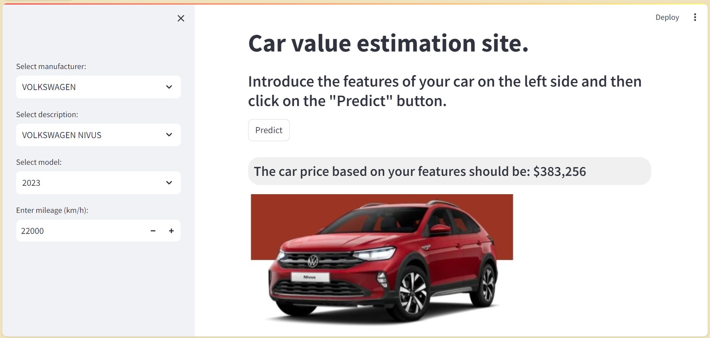

# Car Price Prediction Website

Welcome to **Car Price Prediction Website**. This project is made to estimate the value of a car depending on its characteristics, emulates sites such as Kavak, CarFirst, Cazoo or other car sales companies. (Click on the image below to go to the app website.)

## Table of Contents
- [Introduction](#introduction)
- [Features](#features)
- [Usage](#usage)

## Introduction
This Car Value Prediction Website was developed by a Machine Learning model, a regression model was trained with data based on the real market value published by the pages of each car brand. The front of this application was made with the python library called Streamlit for easy use.

## Features
- *Manufacturer*: *Car brands (Volkswagen, Honda, Toyota, ...).*
- *Model*: *The model of the car (2014 - 2024)*
- *Description*: *Car description of each brand (Nissan Versa, Toyota Prius, Honda HR-V,...).*
- *Mileage*: *Mileage travelled per vehicle in km/h.*
- *Price*: *The car price of the market value.*

## Usage
The website is made to interact with the user in a friendly way, just select the buttons according to the characteristics of the car.